# Guía de usuario para el backoffice de Fiuumber

**1. Inicio de sesión para administradores**

**1.1. Pantalla para iniciar sesión**

Al abrir la página web, se muestra la pantalla de Login para administradores ya registrados. Para iniciar sesión, se debe ingresar el correo electrónico y la contraseña. Una cuenta de administrador debe ser creada desde otra cuenta de administrador, por lo que de no poseer una cuenta, otro administrador deberá crearla por usted. Una vez ingresados el correo electrónico y la contraseña, se debe presionar el botón de _Sign in Now_ para continuar.

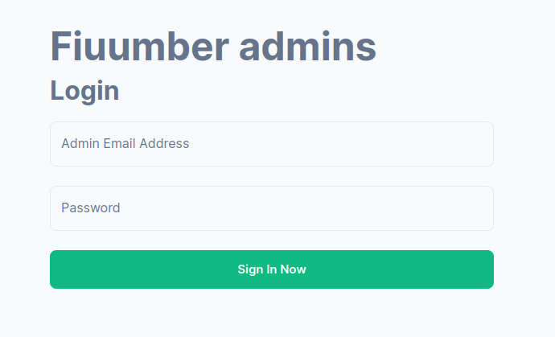

**1.1 Inicio de sesión fallido**

En caso de haberse ingresado un correo electrónico o contraseña inválidos, se mostrará un mensaje de error y el usuario no podrá acceder al servicio de administradores.

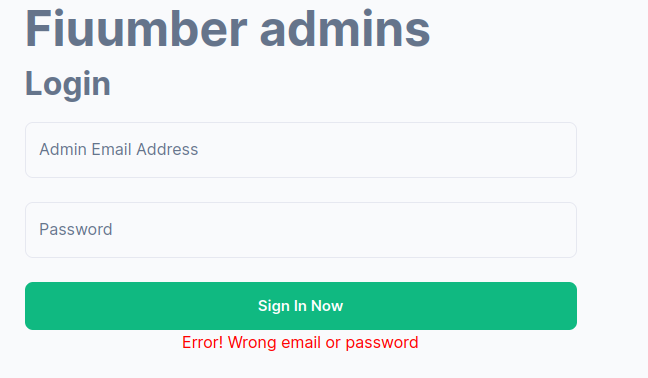

**1.2 Inicio de sesión exitoso**

Si el correo electrónico y la contraseña ingresados son correctos, se redireccionará al usuario a la página principal del servicio de administración. En esta pantalla principal, se observará el panel de métricas, y un menú a la izquierda que permite elegir otros paneles: Pasajeros, Conductores, Administradores, Cotización y Registro de un nuevo administrador.

Además, en la esquina superior izquierda se cuenta con un botón, que, al ser presionado, permite visualizar el perfil propio o cerrar sesión.

**2. Visualización de métricas**

Al seleccionar la opción _Metrics_ en el menú de la izquierda de la pantalla, se pueden observar, en primer lugar, distintas métricas acerca de los usuarios (es decir, pasajeros y conductores). En primer lugar, se observa un gráfico de barras que muestra la cantidad de Logins, tanto con usuario y contraseña, como con identidad federada, para cada día en un rango determinado (en el menú desplegable pueden seleccionarse tanto el rango de los últimos siete días como el rango de los últimos treinta).

Debajo del gráfico de Logins, se puede observar un gráfico de barras que indica la cantidad de Signups por día (nuevamente, tanto con usuario y contraseña como con identidad federada). Una vez más, los rangos de días disponibles son la última semana o el último mes.

A continuación, pueden observarse dos gráficos de dona, uno indicando el porcentaje y las cantidades de usuarios bloqueados vs. usuarios no bloqueados, y otro indicando los porcentajes y las cantidades de administradores, pasajeros y conductores de vehículos en el sistema.

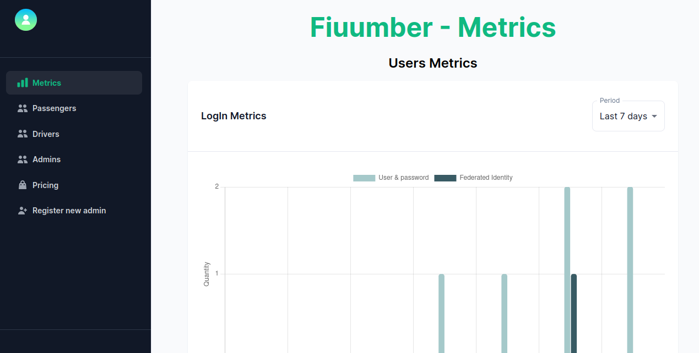

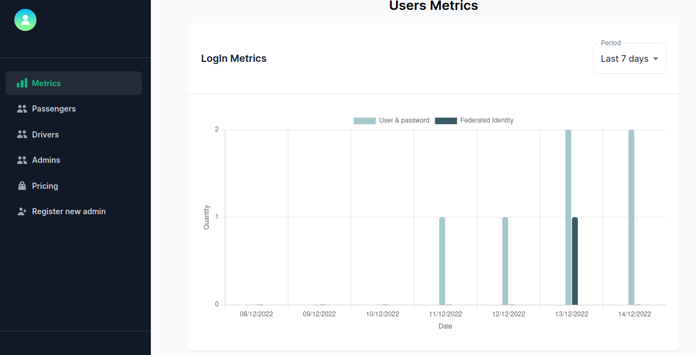

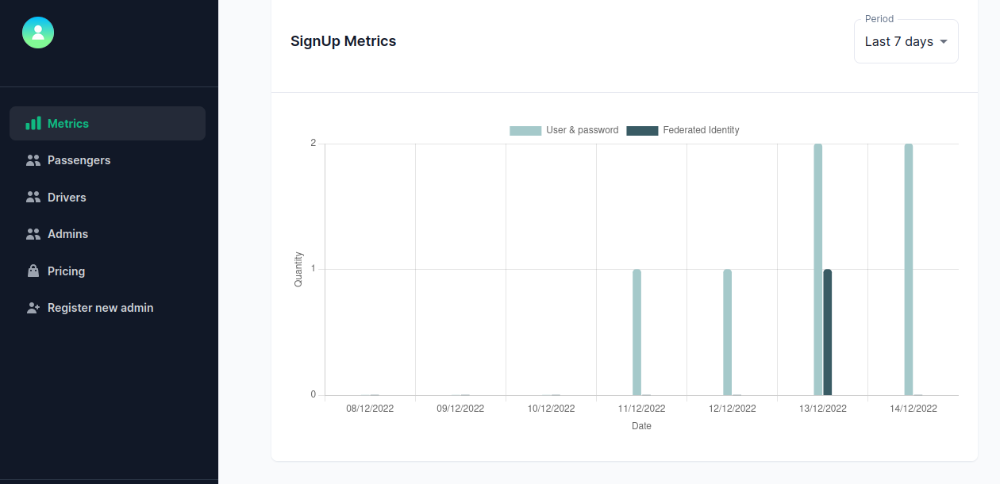

Debajo de las métricas de usuarios, hay un botón que al presionarlo permite ver las métricas de viajes. Se pueden observar dos gráficos: uno indicando la cantidad de nuevos viajes por día en cierto rango de días (última semana o último mes), y un histograma indicando la duración de los viajes en la última semana/mes. Las duraciones de los viajes están agrupadas en rangos de diez minutos.

**3. Visualización de todos los pasajeros**

**3.1 Listado de los pasajeros del sistema**

Al seleccionar la opción _Passengers_, se listan todos los pasajeros del sistema. Se puede observar una tabla en la que cada fila incluye el nombre, el apellido, el nombre de usuario, el correo electrónico y la dirección de un pasajero. Pueden seleccionarse la cantidad de pasajeros a observar por página, y se puede navegar entre páginas con las flechas en la esquina inferior derecha. Además, para cada pasajero puede presionarse el botón _"View Profile"_.

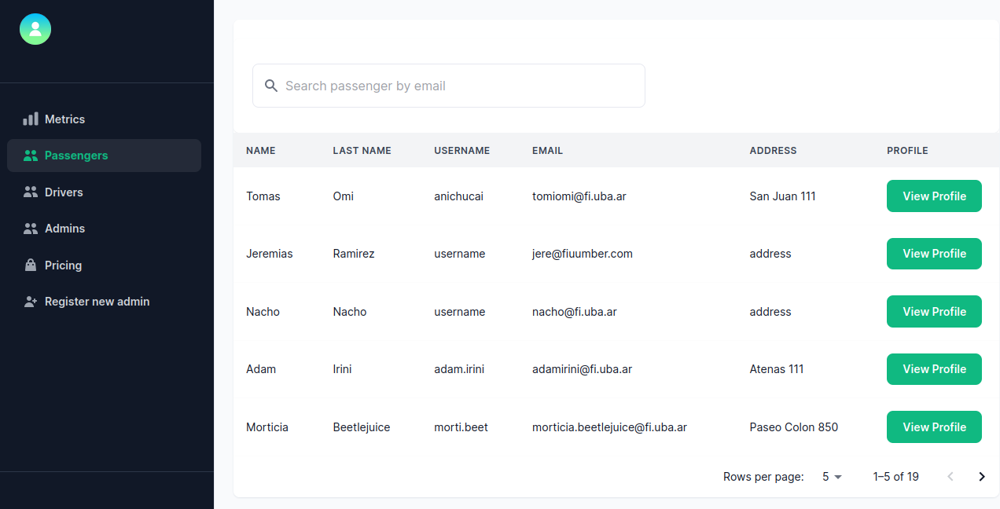

**3.2 Visualización del perfil de un pasajero**

Al presionar el botón "View profile" de un pasajero en particular, se redirige a una nueva página en la que se cuenta con información más específica acerca del pasajero. En esta página, se cuenta con un botón _"Block user"_ para bloquear al pasajero en caso de que no esté bloqueado, o un botón de _"Unblock user"_ en caso de que esté bloqueado. También se cuenta con un botón "Cargar Saldo" [**explicarlo]**

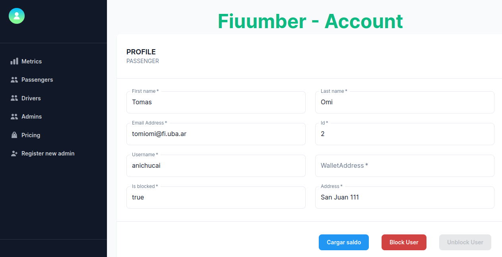

También pueden observarse gráficos acerca del historial de viajes de este pasajero en particular y acerca del estado de sus viajes (esto en caso de que haya hecho algún viaje).

**4. Visualización de todos los conductores**

**4.1 Listado de todos los conductores**

Al seleccionar la opción _Drivers_, se listan todos los conductores del sistema. Se puede observar una tabla en la que cada fila incluye el nombre, el apellido, el nombre de usuario, el correo electrónico, la dirección y la matrícula de un conductor. Pueden seleccionarse la cantidad de conductores a observar por página, y se puede navegar entre páginas con las flechas en la esquina inferior derecha. Además, para cada conductor puede presionarse el botón _"View Profile"_.

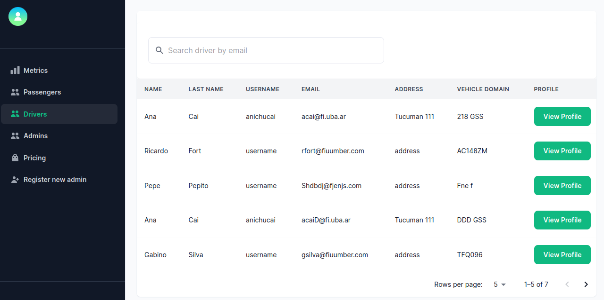

**4.2 Visualización del perfil de un conductor**

Al presionar el botón de "View Profile", se redirige a una nueva página en la que se cuenta con información más específica acerca del conductor: el modelo, marca, año y color de su vehículo. En esta página, se cuenta con un botón _"Block user"_ para bloquear al conductor en caso de que no esté bloqueado, o un botón de _"Unblock user"_ en caso de que esté conductor. También pueden observarse gráficos acerca del historial de viajes de este conductor en particular y acerca del estado de sus viajes (esto en caso de que haya hecho algún viaje).

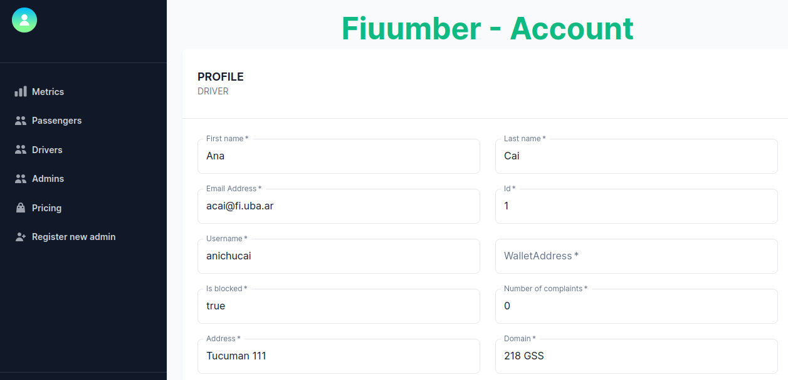

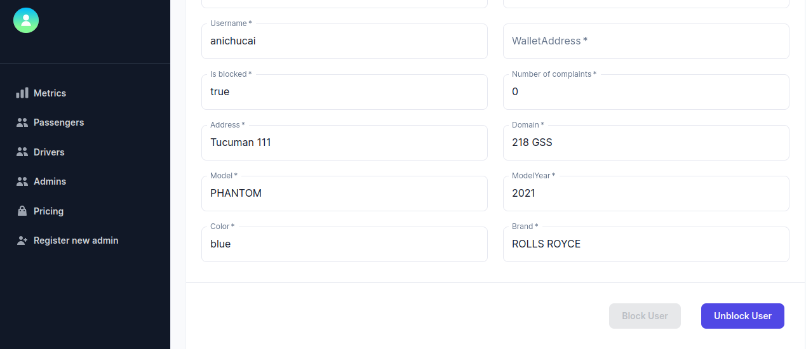

**5. Visualización de todos los administradores**

**5.1 Listado de administradores**

Al seleccionar la opción _Admins_, se listan todos los administradores del sistema. Se puede observar una tabla en la que cada fila incluye el nombre y el apellido de un administrador. Pueden seleccionarse la cantidad de administradores a observar por página, y se puede navegar entre páginas con las flechas en la esquina inferior derecha. Además, para cada conductor puede presionarse el botón _"View Profile"_.

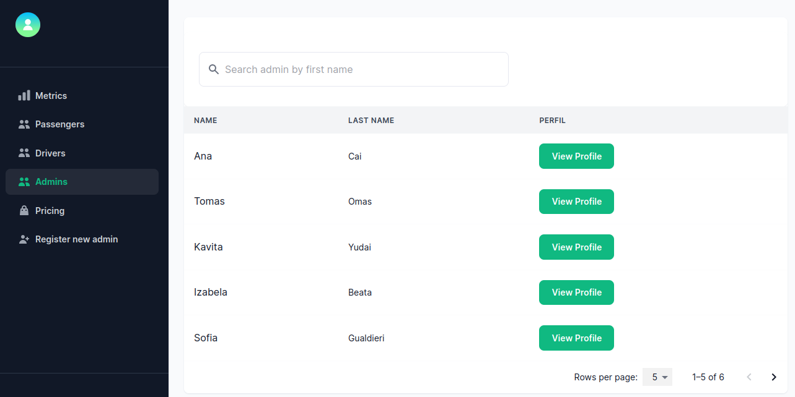

**5.2 Visualización del perfil de un administrador**

Al presionar el botón de "View Profile", se redirige a una nueva página en la que se cuenta con información más específica acerca del administrador, como su _id_ interno del sistema.

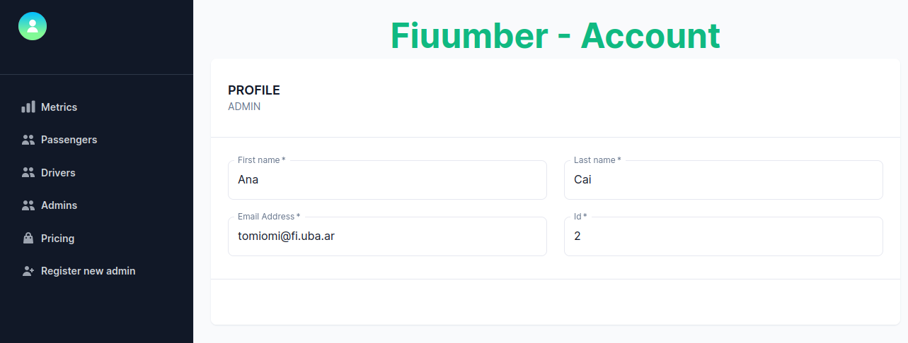

**6. Reglas de cotización**

**7. Registro de un nuevo administrador**

**7.1 Pantalla de registro de un nuevo administrador**

Al seleccionar la opción _Register a new admin_, se redirecciona a una página para registrar a un nuevo administrador en el sistema. Para ello, deben indicarse el nombre, el apellido, el correo electrónico y la contraseña de este nuevo administrador a registrar. Luego, debe presionarse el botón "Sign Up Now".

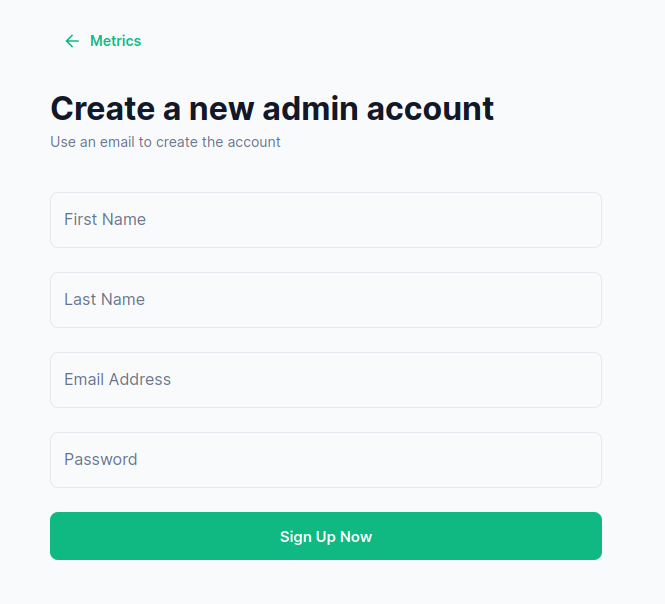

**7.2 Registro fallido**

En caso de no indicarse alguno de los valores solicitados, el registro de un nuevo administrador fallará, y se indicará una advertencia por debajo de cada uno de los campos faltantes.

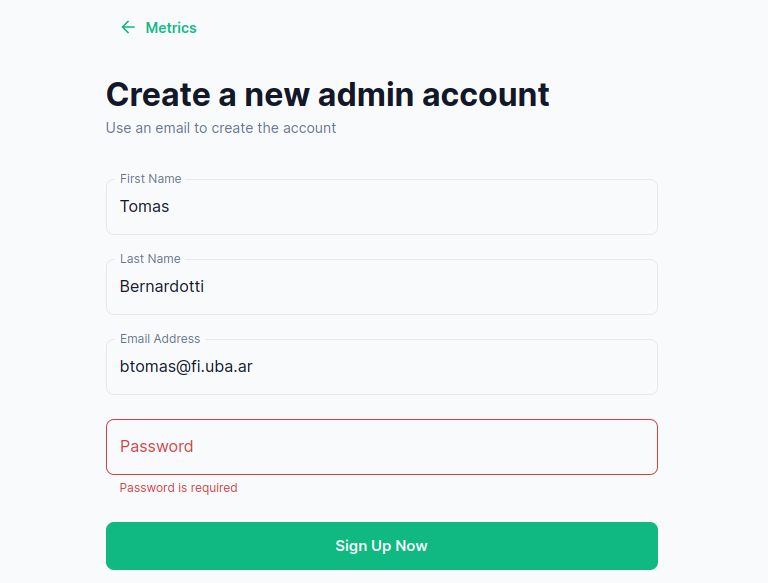

**7.3 Registro exitoso**

En caso de indicar correctamente todos los campos solicitados, se redirige al administrador a la pantalla que lista todos los administradores, sin cerrar sesión del administrador logueado actualmente. El nuevo administrador creado podrá iniciar sesión cuando lo desee.
